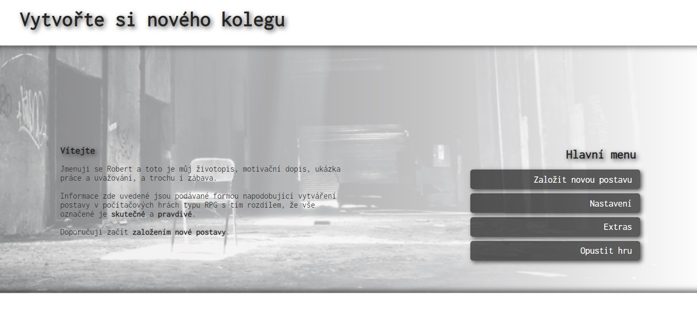

# Osobní webové stránky / Personal Web Page  

Vítám vás,  
zde najdete zdrojový kód mých osobních webových stránek [~~robertbelan.com~~](https://www.robertbelan.com/) (již nefunkční, přemisťuji na GH Pages) a k nim doplňující informace. 

---

---

### Shrnutí
Dosavadní kód vyžaduje značnou úpravu, ale **funguje**. 

**Todo:**  
> - [x] "Make it work,  
> - [ ] make it right,  
> - [ ] make it fast."  
>                 _Kent Beck_

 

### Důvod vzniku webu

- **Upevnění** získaných znalostí o JavaScriptu v kurzu [Learn Javascript](https://learnjavascript.online/).
- **Sebeprezentace** takovým způsobem, který by mohl někoho zaujmout a věnoval mi tak více času než jiným běžným CV.
- Možnost **vyřádit se** na *svém písečku* podle vlastních pravidel a nápadů.
- Mít něco dalšího komplexnějšího "v ruce" při hledání své **první práce** v IT.

 

### Některé nedostatky aktuální verze webu
- Web má pouze jednu URI ("/") a to i přesto, že se dá doklikat až do "hloubky" tří kliknutí.
- Chybí code splitting s využitím dynamických importů apod.
- Řada UX pochybení. Někteří se na webu ztrácí a neví *co, kde a kam*.
- Porušení principu **DRY**. 
- Chybí anglická lokalizace.
  
 

### Co se mi líbí na webu
- To, že jsem jej dokázal **vytvořit** a **funguje**.
- Nápad.
- Je plynulý.
- Znovu, to že jsem jej dokázal **vytvořit** a **funguje**. I přesto, že má spoustu "ale" :-) Budu z něj vycházet při vytváření jeho vyzrálejší verze.
- To, že mi při úpravě 3D modelu neshořel můj postarší kancelářský notebook. A také to, že jsem jej neprohodil oknem. Při manipulaci s polygony jsem přišel o mnoho vlasů.

 

### Co jsem se při jeho vzniku naučil/dozvěděl?
  
Těch věcí je nespočet. Na všechny si nevzpomenu a nikdo by to ani nečetl. Vyberu proto pouze některé významnější.

- Je zprvu těžké najít tu hranici, kdy něco stačí mít na úrovni *good-enough*, kdy něco musí být takřka perfektní a kdy člověk řeší opravdu hlouposti.
- *One-man-show* přístup má výhodu v tom, že člověk nemusí nikomu obhajovat svá rozhodnutí. Mně ten přístup **nevyhovuje**. Potřebuju být v týmu.
- Nechat si zeditovat texty, než něco pustím do světa. Zvláště pokud toho autorského textu je více (I tento text by editaci snesl, ale 'moje' editorka má prý taky svůj osobní život)
-  A co je pro mě zásadní - dozvěděl jsem se opět, že mě to všechno kolem zatraceně baví.

 

*Brzy dopíši článek o procesu vytváření tohoto webu. Bude určen primárně pro juniory jako jsem já.

---

